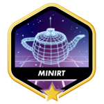

# 42 common core

## What is École 42?

"42 is a future-proof computer science training to educate the next generation of software engineers. The 42 program takes a project-based approach to progress and is designed to develop technical and people skills that match the expectations of the labor market."
 
See more on [École 42](https://42.fr/en/homepage/)

### 15. [ft_transcendence](https://github.com/sgkhusal/42-ft_transcendence)
 
- Web development
- Python, Django
- Vanilla JS
- Database modeling
- Microsservices

### 14. [webserv](https://github.com/sgkhusal/42-webserv)
 
- Unix
- Network & system administration
- Object-oriented programming
- HTTP
- C++

### 13. [inception](https://github.com/sgkhusal/42-inception)
 
- Network & system administration
- Docker
- nginx
- MariaDB

### 12. [CPP piscine](https://github.com/sgkhusal/42-CPP)
 
- Object Oriented Programming (OOP)
- Imperative programming
- C++

### 11. [miniRT](https://github.com/sgkhusal/42-miniRT)
 
- Algorithms & AI
- Imperative programming
- Graphics
- ray tracing
- C

### 10. [NetPractice](https://github.com/sgkhusal/42-net-practice)
 
- Network & system administration
- TCP/IP

### 9. [Philosophers](https://github.com/sgkhusal/42-philosophers)
 

An implementation of philosopher's problem
- Unix
- Imperative programming
- threads, data concurrency
- C

### 8. [minishell](https://github.com/sgkhusal/minishell)
 

- [minishell tester](https://github.com/sgkhusal/minishell_tester) by me and my minishell partner
- Unix
- Imperative programming
- C

### 7. [push_swap](https://github.com/sgkhusal/42-push-swap)
 
- Unix
- Algorithms & AI
- Imperative programming
- sorting algorithms
- C

### 6. [pipex](https://github.com/sgkhusal/42-pipex)
 
- Unix
- Imperative programming
- C

### 5. [so_long](https://github.com/sgkhusal/42-so_long)
 
- Imperative programming
- Graphics
- C

### 4. [Born2beroot](https://github.com/sgkhusal/42-Born2beRoot)
 
- Network & system administration
- Virtual Machine
- Debian

### 3. [ft_printf](https://github.com/sgkhusal/42-ft_printf)
 
- Algorithms & AI
- C

### 2. [get_next_line](https://github.com/sgkhusal/42-GNL)
 
- Unix
- Algorithms & AI
- C

### 1. [Libft](https://github.com/sgkhusal/42-libft)
 
- Algorithms & AI
- Imperative programming
- C
